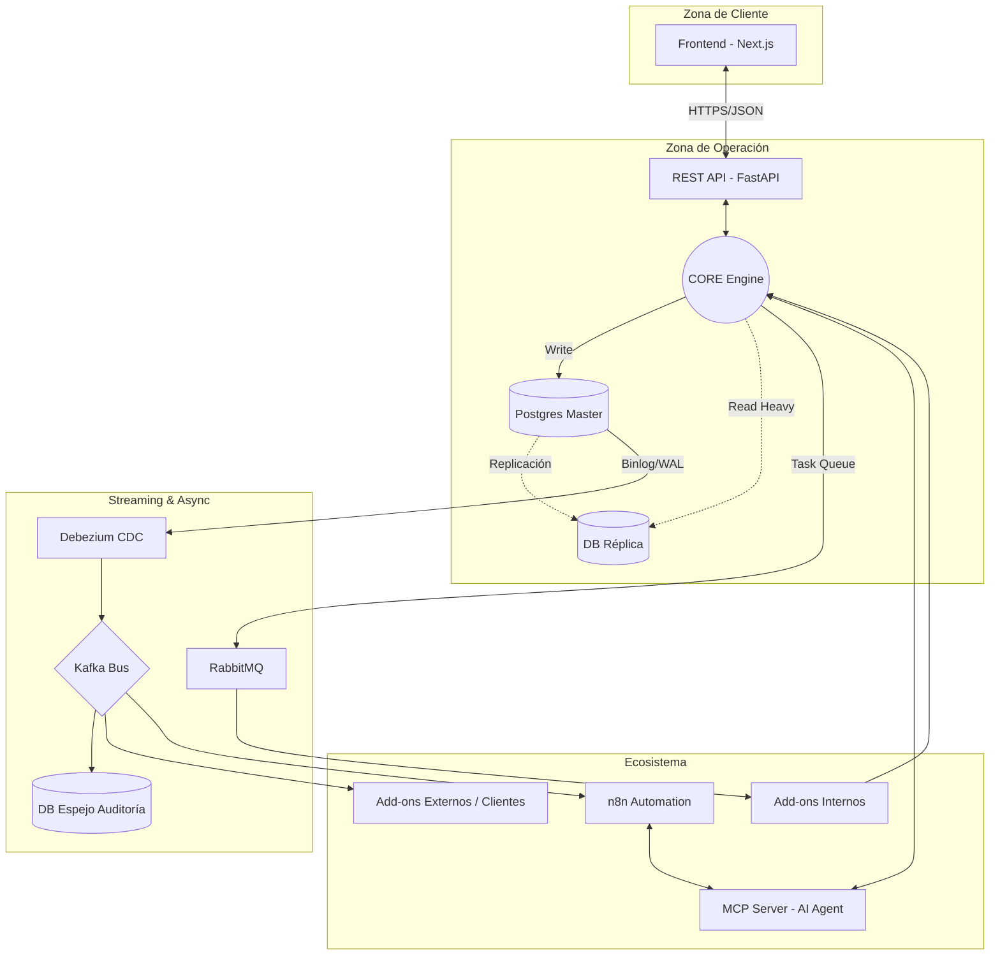

# 🗺️ ERP3 - Core Flow & Architecture

Este documento define el flujo de datos y la jerarquía de componentes del sistema ERP3. **IA: Consultar este mapa antes de realizar cambios en la infraestructura o en la lógica de eventos.**

## 🏗️ Diagrama de Flujo (Mermaid)

Este diagrama representa la vida de un dato desde el Frontend hasta el sistema de auditoría.

## 🚦 Reglas de Enrutamiento de Datos (Contexto para IA)

### 1. Persistencia (Postgres)

- **Escritura:** Solo en `DB_M` (Master). Nunca realizar `INSERT/UPDATE` en la réplica.
    
- **Lectura:** Consultas transaccionales rápidas en `Master`. Reportes, históricos y auditorías pesadas en `DB_R` (Réplica).
    

### 2. Comunicación Asíncrona

- **RabbitMQ:** Usar para tareas internas del sistema que requieren respuesta o confirmación (ej: generación de PDFs, envío de correos, jobs de mantenimiento).
    
- **Kafka (via Debezium):** Usar para la "salida al mundo". Todo cambio en la base de datos se emite aquí para que sistemas externos (o el Espejo de Auditoría) reaccionen sin bloquear el Core.
    

### 3. Inteligencia & Automatización (MCP + n8n)

- **MCP Server:** Actúa como el puente de contexto. Provee a los modelos locales (Ollama/LM Studio) acceso de solo lectura a los esquemas y datos para análisis.
    
- **n8n:** Orquestador de entrada/salida. Puede inyectar datos al Core vía REST API tras procesar eventos externos (Webhooks, WhatsApp, Emails).
    

---

## 📂 Estructura de Módulos (`app.core.*`)

- `auth`: Gestión de identidad y JWT.
    
- `database`: Configuración de motores (Writer/Reader).
    
- `infrastructure`: Implementación de Brokers (Kafka/RabbitMQ).
    
- `models`: Definiciones de tablas base para el ERP.